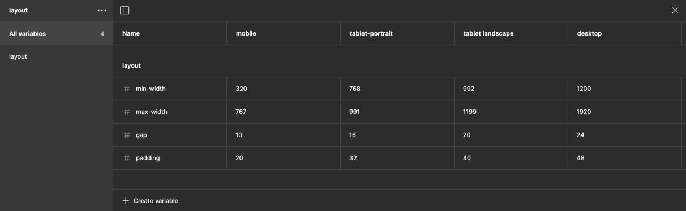
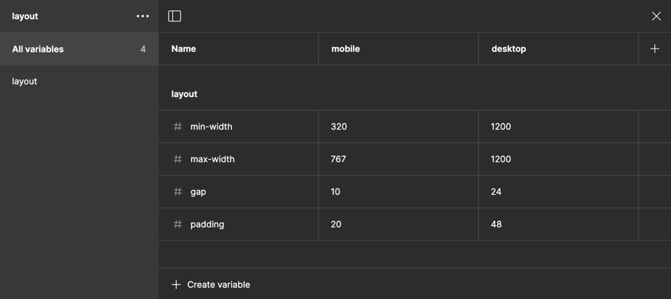

# Примеры настройки лэйаута

В основе один и тот же принцип, на основе которого можно получить:

**Responsive** — для адаптивного дизайна под мобилки, планшеты и десктоп

**Desktop + Mobile** — для проектов с отдельной десктопной и мобильной версиями. Каждое разрешение можно настроить под фиксу или флюид. Для примера — настройки под флюид мобилку и фикс десктоп

- **Single Sizeclass** — для случаев, когда вы рисуете тупо под мобилку или десктоп

- **Bootstrap** — честно настроенный грид со всеми промежуточными шагами. _Для корректной работы в фигме требует более 4 модов_ Если ваш проекто использует бутстрап со всеми промежуточными брейкпоинтами, но в фигме доступно только 4 мода — в StarterKit можно использовать Responsive-сетап

- **Single Detailed** — например, если вы делаете мобильное приложение, в котором важно подгонять лэйаут под разные устройства. По сути ничем не отличается от респонсива, но просто для примера